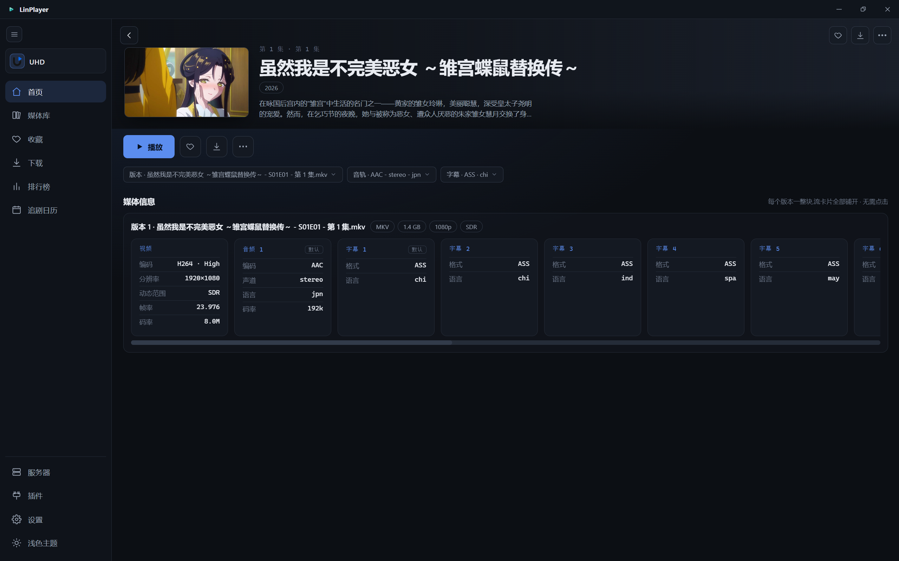
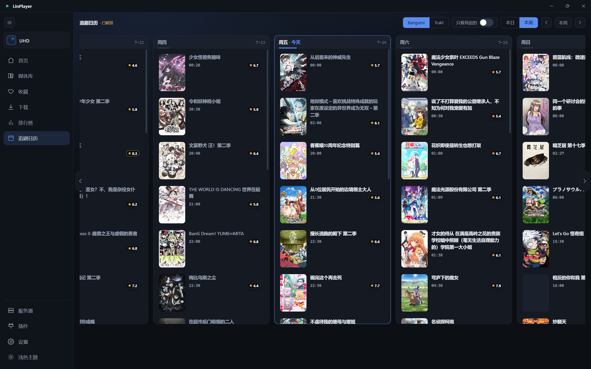
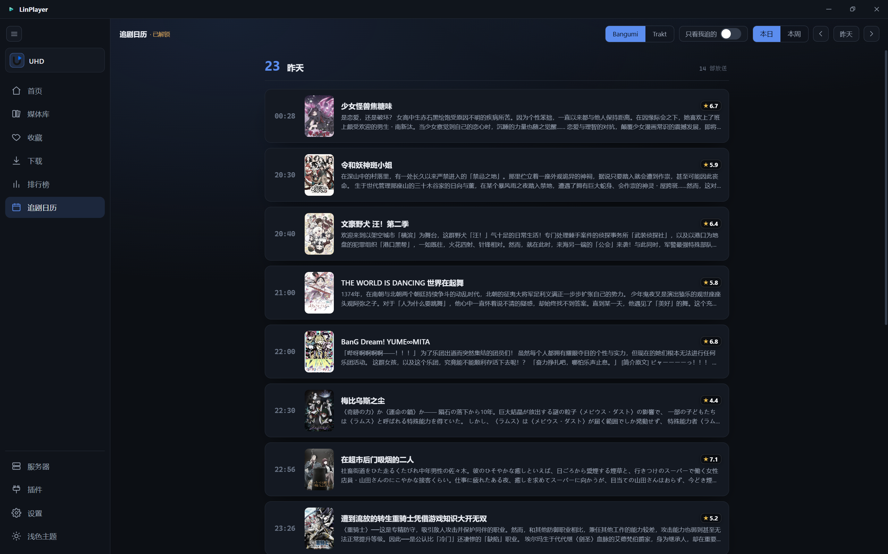
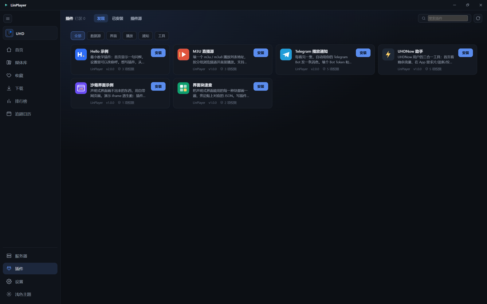
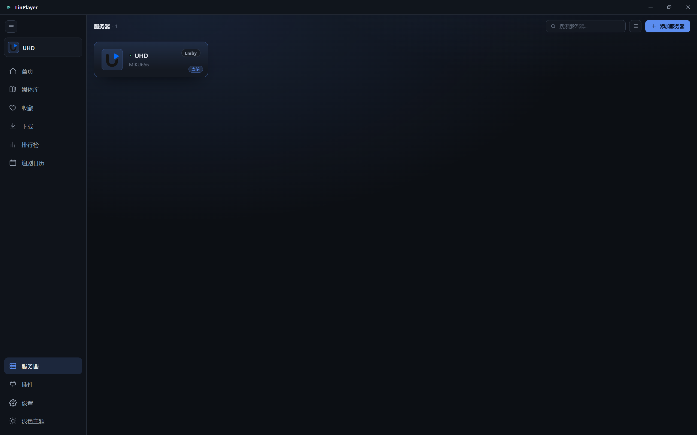
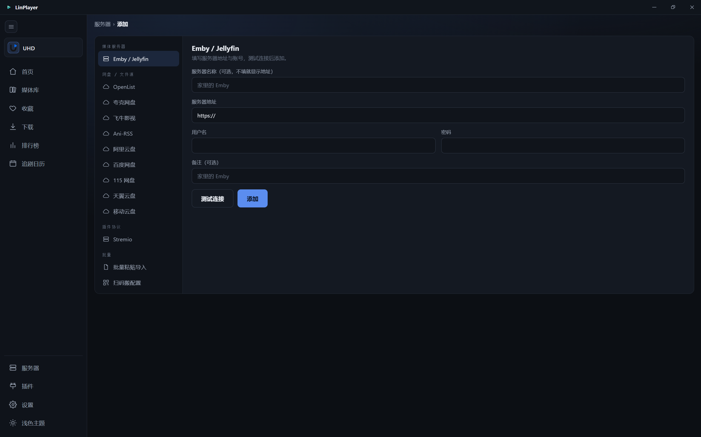
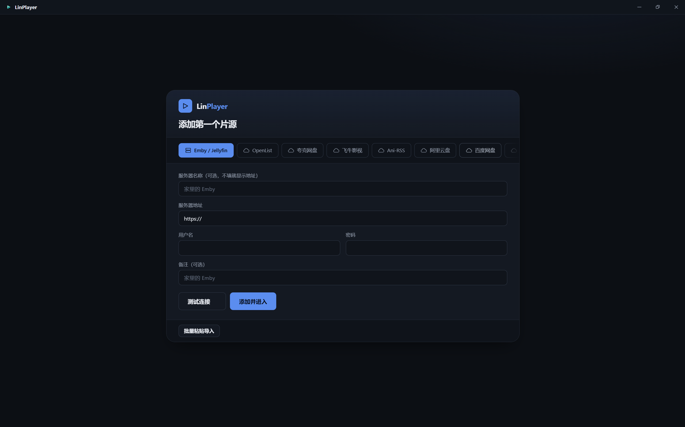

# LinPlayer

  
  
  
  
  
  
  
  
  
  
  

  <a href="../README.md">简体中文</a> ·
  <b>English</b> ·
  <a href="README.ja.md">日本語</a>

**LinPlayer** is a third-party Emby client targeting **Windows / Linux / Android / Android TV**.

> ### 🚧 Under reconstruction (2026-07)
>
> The project has migrated from Flutter to a **Rust core + React/TypeScript UI + Tauri shell**.
>
> - **Desktop (Windows / Linux)** — working, shipping normally.
> - **Android / Android TV** — UI being rebuilt; no new builds for now.
> - **Apple platforms (iOS / macOS / tvOS)** — no longer supported, removed from the repo.
>
> The complete Flutter-era code is preserved at tag [`flutter-final`](https://github.com/zzzwannasleep/LinPlayer/tree/flutter-final).

Business logic (data sources, networking, playback control, sync, downloads) lives in a **single Rust crate shared by every platform**; each platform only writes its own UI. So a 🔨 below does not mean "not built yet" — it means **the core is ready and waiting for UI wiring**.

## Features

| Feature | Notes | Desktop | Android / TV |
|:--|:--|:--:|:--:|
| **MPV player core** | All formats; HDR / Dolby Vision (auto gpu-next + software decode); PGS/SUP graphic subtitles; Anime4K upscaling and quality presets | ✅ | 🔨 |
| **Danmaku** | DanDanPlay and other backends, smart episode matching, parallel sources, adjustable outline and display area | ✅ | 🔨 |
| **Subtitles** | Auto-load Emby subtitle streams; track switching, delay, font/size/position; full libass effects | ✅ | 🔨 |
| **Multi-source browsing** | Beyond Emby: OpenList, Quark (cookie / QR), Ani-rss, Feiniu | ✅ | 🔨 |
| **Playback sync** | Emby progress reporting, cross-server resume | ✅ | 🔨 |
| **Trakt / Bangumi** | Scrobbling and anime watch-progress sync | ✅ | 🔨 |
| **Airing calendar** | Trakt / Bangumi release schedules | ✅ | 🔨 |
| **Rankings** | DanDanPlay anime chart + TMDB movie/TV chart (toggleable) | ✅ | 🔨 |
| **Downloads** | Custom multi-threaded ranged download engine | ✅ | 🔨 |
| **Multi-threaded loading** | Local prefetch proxy, concurrent ranged reads feeding the player ahead of playback | ✅ | 🔨 |
| **Proxy** | Custom proxy + Cloudflare best-IP local reverse proxy | ✅ | 🔨 |
| **Plugin system** | QuickJS engine, per-plugin isolation — crashes and timeouts never reach the host | ✅ | 🔨 |
| **Bulk server import** | Paste multi-line configs and import them in one pass | ✅ | 🔨 |
| **Config migration** | Transfer server configs between devices by QR (credentials included, fully offline) | ✅ | 🔨 |
| **In-app updates** | Dual channel (stable / pre) overwrite updates | ✅ | 🔨 |

✅ wired and usable · 🔨 core ready, UI being rebuilt

## Screenshots

### Desktop

> Content shown courtesy of [**UHD MEDIA**](https://www.uhdnow.com).

<table>
  <tr>
    <td colspan="2"> <b>Player</b></td>
  </tr>
  <tr>
    <td width="50%"> <b>Home</b></td>
    <td width="50%"> <b>Library</b></td>
  </tr>
  <tr>
    <td> <b>Series Detail</b></td>
    <td> <b>Episode Detail</b></td>
  </tr>
  <tr>
    <td> <b>Rankings</b></td>
    <td> <b>Favorites</b></td>
  </tr>
  <tr>
    <td> <b>Calendar · Week</b></td>
    <td> <b>Calendar · Day</b></td>
  </tr>
  <tr>
    <td> <b>Plugins</b></td>
    <td> <b>Servers</b></td>
  </tr>
  <tr>
    <td> <b>Add Server</b></td>
    <td> <b>Settings</b></td>
  </tr>
  <tr>
    <td colspan="2" width="50%"> <b>First-run Login</b></td>
  </tr>
</table>

### Mobile

<b>Flutter-era screenshots</b> — the new Android UI is being rebuilt; these will be replaced

 

> Content shown courtesy of [**BAVA**](https://shop.mebimmer.de).

<table>
  <tr>
    <td colspan="3"> <b>Player</b></td>
  </tr>
  <tr>
    <td width="33%"> <b>Home</b></td>
    <td width="33%"> <b>Series Detail</b></td>
    <td width="33%"> <b>Episode Detail</b></td>
  </tr>
  <tr>
    <td> <b>Movie Detail</b></td>
    <td> <b>Rankings</b></td>
    <td> <b>Settings</b></td>
  </tr>
</table>

## Development & Tech

Repository layout, local development & builds, and the tech stack — see the **[development docs →](DEVELOPMENT.md)**.

## Disclaimer

### About Content & Media

- LinPlayer is a **purely local player / third-party client**. It **does not provide, store, host, or distribute any video content**, and ships with no built-in content sources.
- All media shown and played inside the app comes from **servers the user adds themselves (e.g. Emby) or network sources the user configures themselves**. The origin, copyright, and legality of that content **are solely the user's responsibility**.
- Please only play content you **lawfully own or are authorized to access**, and comply with the laws and regulations of your country/region. Any dispute, loss, or legal liability arising from improper use **is borne solely by the user** and is unrelated to this project or its developers.
- This project is **free, open-source, and non-profit**; it makes no money from content distribution in any form. If a rights holder finds certain content inappropriate, the issue lies with the content's source — please contact the corresponding resource/server provider.

### About Anonymous Telemetry & Privacy

- To continuously improve stability, LinPlayer integrates [Sentry](https://sentry.io) for **crash/error reporting** and **anonymous active-usage statistics** (used only to understand crashes and rough usage scale).
- We **never collect any information that can identify you personally**: no accounts, passwords, cookies, tokens, server addresses, library contents, watch history, or IP addresses. **No screen recording, no behavior tracking.**
- Reported data contains only **anonymous crash stack traces, app version, and platform/OS type** and similar technical info, with devices distinguished by a random anonymous identifier (counting heads, not identities).
- We **never sell, share, or use this data for advertising or any commercial purpose**. The configuration is publicly auditable: [`ui/desktop/telemetry.ts`](../ui/desktop/telemetry.ts) and [`apps/desktop/src/telemetry.rs`](../apps/desktop/src/telemetry.rs).

## License

[LICENSE](../LICENSE)

## Acknowledgements

LinPlayer stands on the shoulders of these open-source projects, media services and cores:

### Player Cores

- [mpv](https://github.com/mpv-player/mpv) / [libmpv](https://github.com/mpv-player/mpv) — full-format playback core
- [shinchiro mpv-winbuild](https://github.com/shinchiro/mpv-winbuild-cmake) — full-featured libmpv prebuilds for Windows
- [Anime4K](https://github.com/bloc97/Anime4K) — real-time anime upscaling GLSL shaders
- [mpv_PlayKit](https://github.com/hooke007/mpv_PlayKit) — quality-preset shader ports and documentation
- [AMD FidelityFX (FSR / CAS)](https://github.com/GPUOpen-LibrariesAndSDKs/FidelityFX-SDK) — upscaling and sharpening shaders
- [NVIDIA Image Scaling](https://github.com/NVIDIAGameWorks/NVIDIAImageScaling) — NVScaler / NVSharpen shaders

### UI & Framework

- [Rust](https://www.rust-lang.org/) / [Tokio](https://tokio.rs) / [reqwest](https://github.com/seanmonstar/reqwest) — the business core shared by every platform
- [Tauri 2](https://tauri.app) — desktop shell (windowing / IPC / packaging)
- [React 19](https://react.dev) / [TypeScript](https://www.typescriptlang.org) / [Vite](https://vite.dev) — per-platform UI

### Services & Data Sources

- [Emby](https://emby.media/) — media server
- [DanDanPlay](https://www.dandanplay.com/) — danmaku and anime ranking data
- [TMDB](https://www.themoviedb.org/) — movie/TV ranking data
- [Bangumi (bgm.tv)](https://bgm.tv/) — anime tracking progress and collection sync
- [anibt](https://anibt.net) — thanks to the operator for providing a domestic Bangumi reverse proxy (API and image acceleration) that makes tracking sync work out of the box; also a new-generation BT/magnet search site — rich resources, clean experience, recommended
- [Trakt](https://trakt.tv/) — movie/TV watch history sync (Scrobble)
- [OpenList](https://github.com/OpenListTeam/OpenList) — network-disk aggregation source
- [Ani-rss](https://github.com/wushuo894/ani-rss) — anime RSS subscription and auto-download

### Emby Servers

Thanks to the following Emby servers for providing UI demos and long-term support:

- [UHD MEDIA](https://www.uhdnow.com) — desktop screenshots content
- [BAVA](https://shop.mebimmer.de) — mobile screenshots content

### Network & Proxy

- [rustls](https://github.com/rustls/rustls) — TLS implementation (self-signed certificates allowed per host allowlist)
- [Cloudflare](https://www.cloudflare.com/) — the edge network our best-IP local reverse proxy rides on

### Scripting & Tools

- [QuickJS](https://bellard.org/quickjs/) — plugin script engine

> Content from TMDB and DanDanPlay remains the copyright of its respective owners; this project only aggregates and displays it, and does not store or distribute copyrighted media.

## Star History

<!-- 自建实时图(oauth-proxy/functions/star/history.svg.js)。
     不用 star-history.com:它没命中缓存就现场去 GitHub 拉,超过自己 10 秒上限就回 500，
     README 里那张图「时不时看不了」就是这么来的（实测连 facebook/react 都 500）。 -->
<a href="https://github.com/zzzwannasleep/LinPlayer/stargazers">
 <picture>
   <source media="(prefers-color-scheme: dark)" srcset="https://291277.xyz/star/history.svg?theme=dark" />
   <source media="(prefers-color-scheme: light)" srcset="https://291277.xyz/star/history.svg" />
   
 </picture>
</a>

## Project Activity

## Sponsors

Thanks to everyone supporting LinPlayer on [Afdian](https://afdian.com/a/zzzwannasleep) (list updated in real time):

  

## Join the Channel

Telegram channel [**@MikudesuChannels**](https://t.me/MikudesuChannels) — releases, previews and discussion.
